# Fenics]

## dpg_laplace_adapt

| mesh                                  | sol                                |
| ------------------------------------- | ---------------------------------- |
| 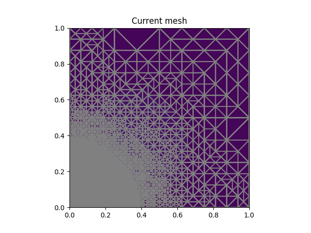   |   |
| 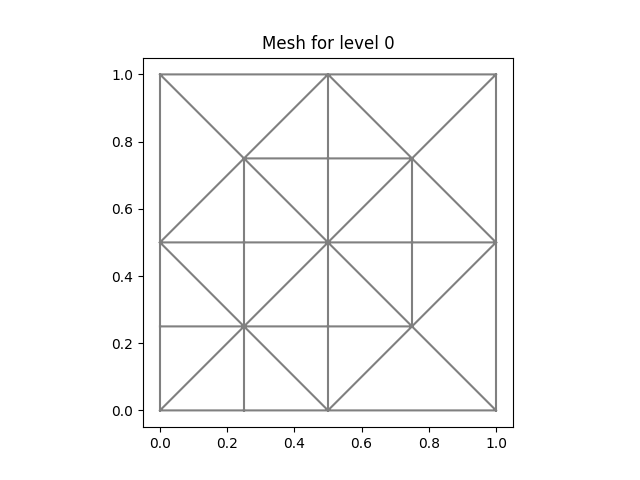 | 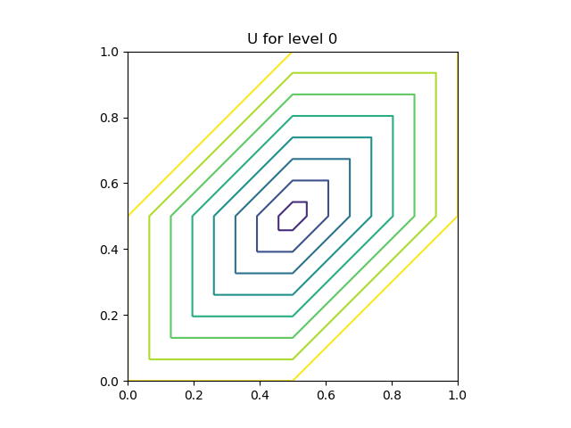 |
| 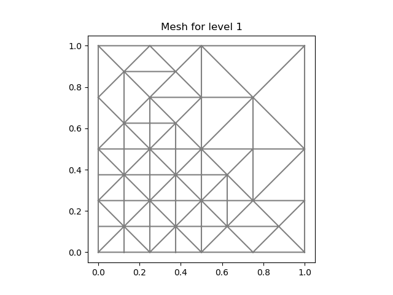 | 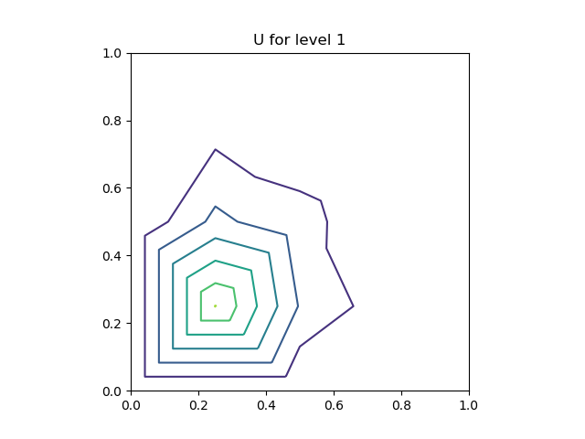 |
| 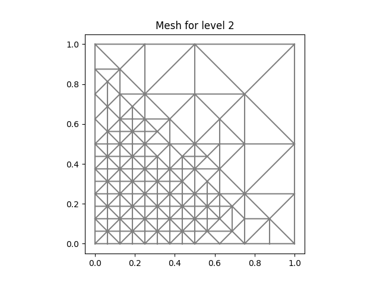 | 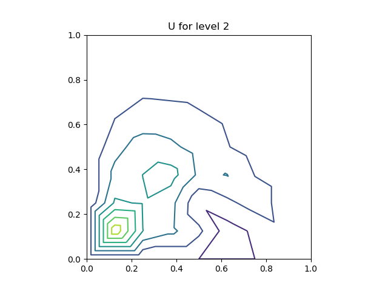 |
| 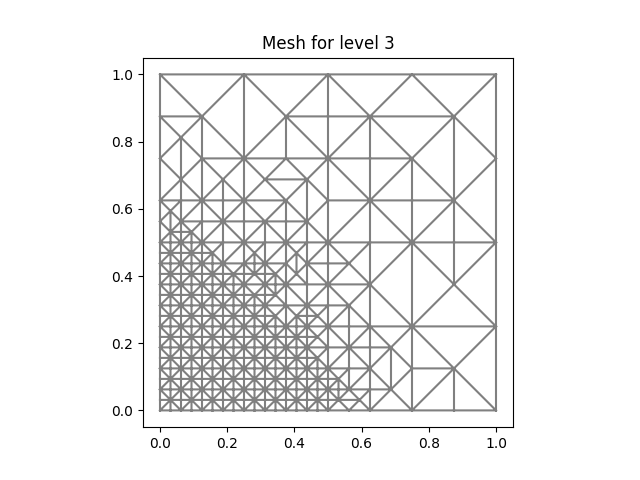 | 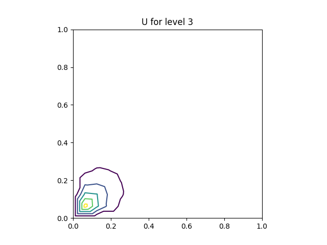 |
| 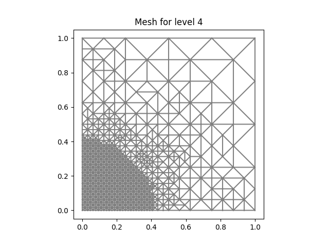 | 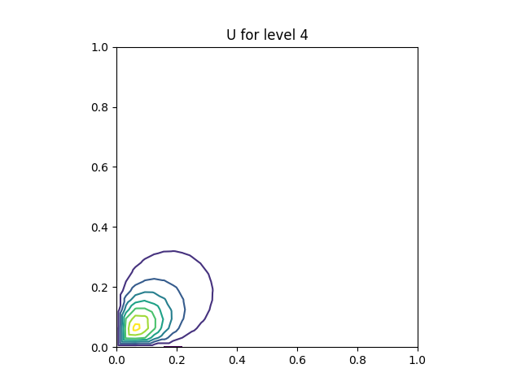 |
| 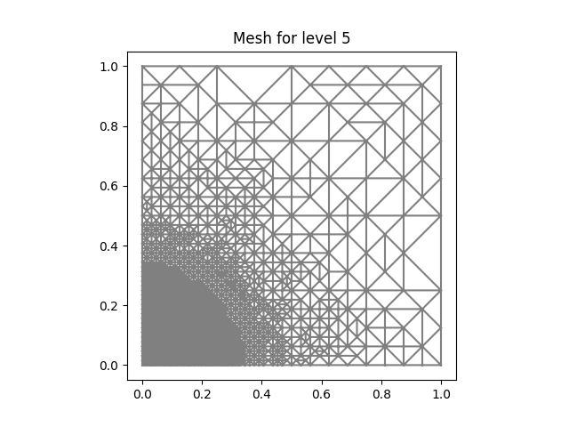 | 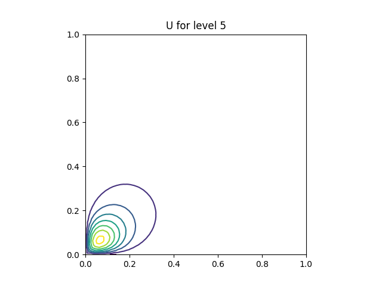 |
| 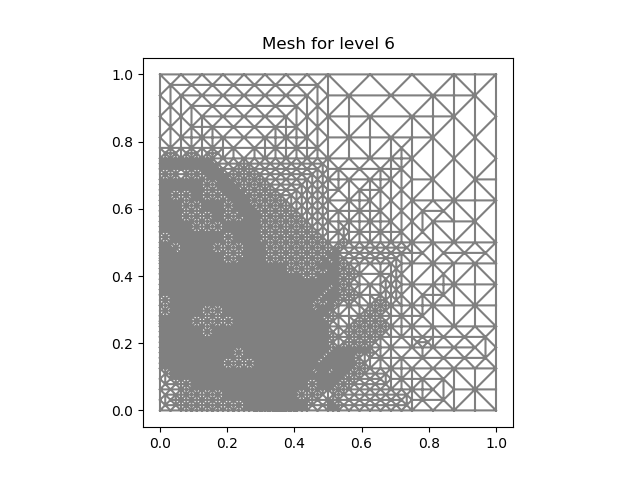 | 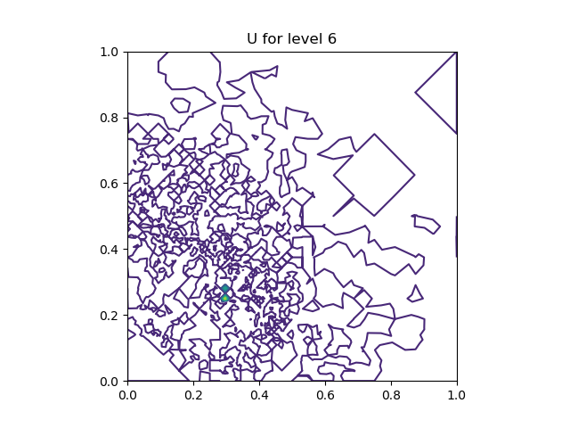 |

## heat_explicit

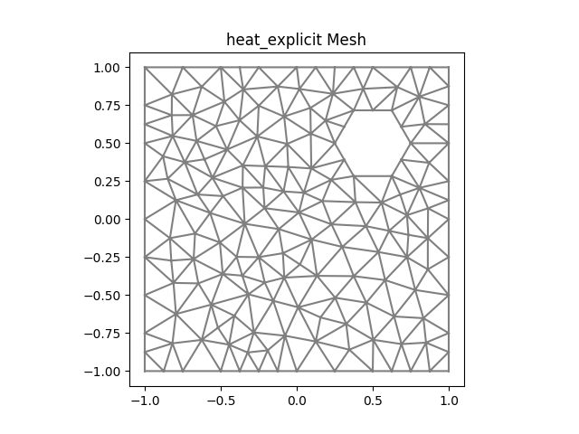

|      num | sol                                                     |
| -------: | ------------------------------------------------------- |
|    num=0 | 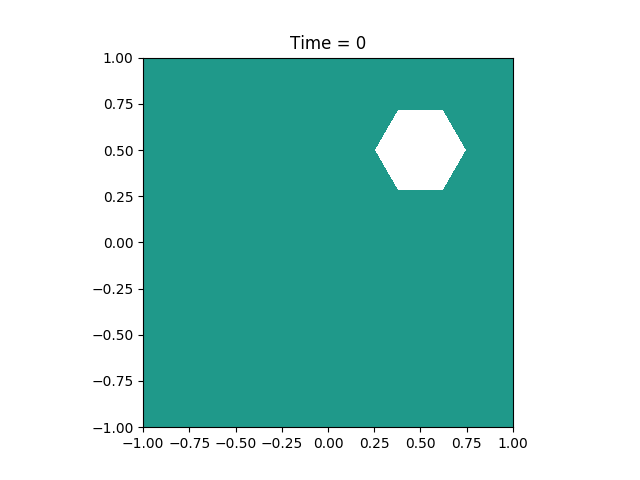    |
|  num=100 | 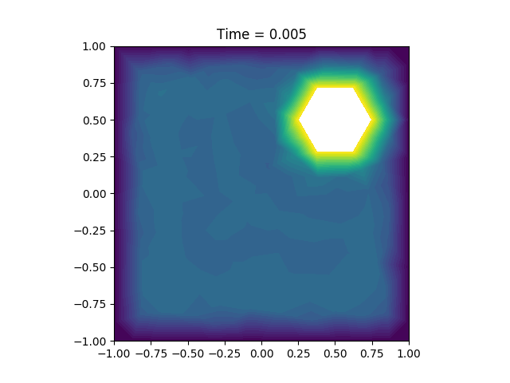  |
|  num=200 | 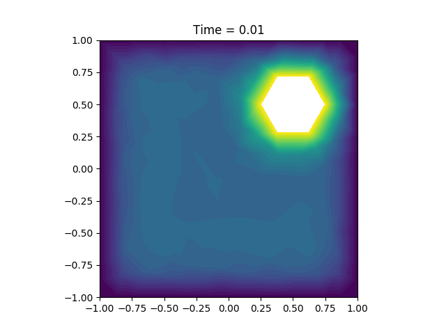  |
|  num=300 | 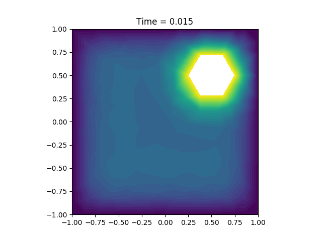  |
|  num=400 | 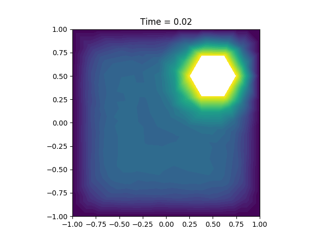  |
|  num=500 | 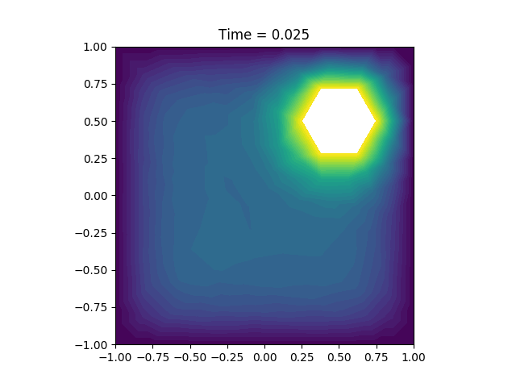  |
|  num=700 | 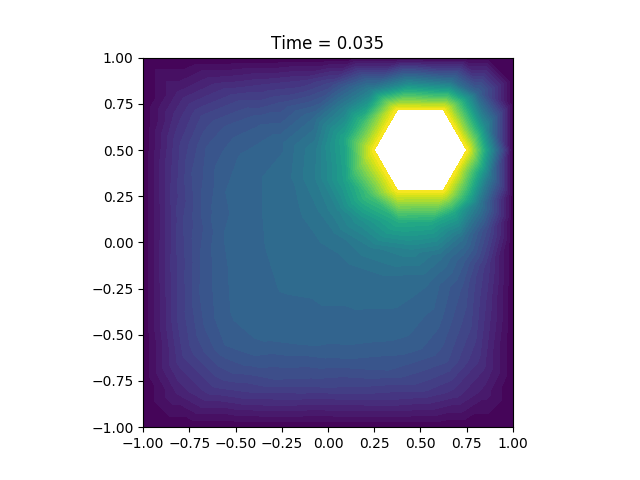  |
|  num=800 |   |
|  num=900 |   |
| num=1000 |  |

## heat_implicit

|    num | sol                                                   |
| -----: | ----------------------------------------------------- |
|  num=0 |   |
|  num=2 | 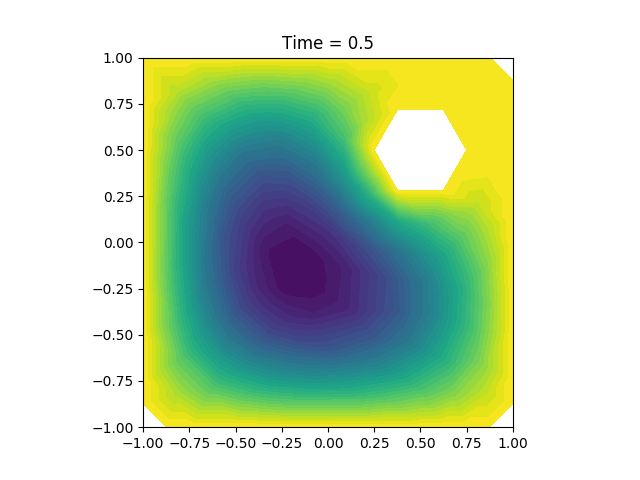  |
|  num=4 | 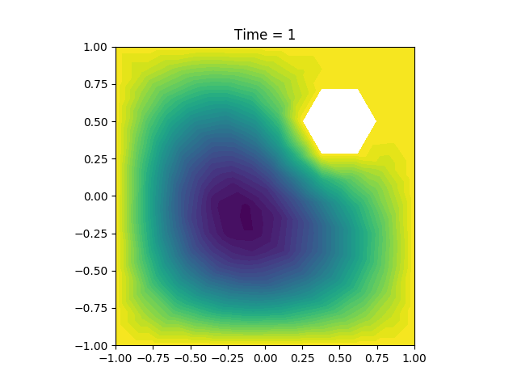  |
|  num=6 |   |
|  num=8 |   |
| num=10 | 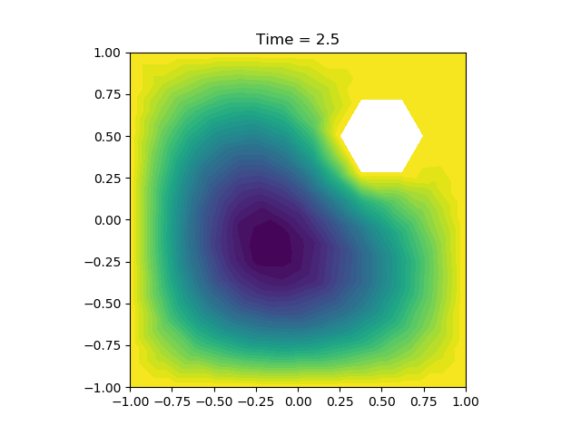 |
| num=12 |  |
| num=14 |  |
| num=16 |  |
| num=18 | 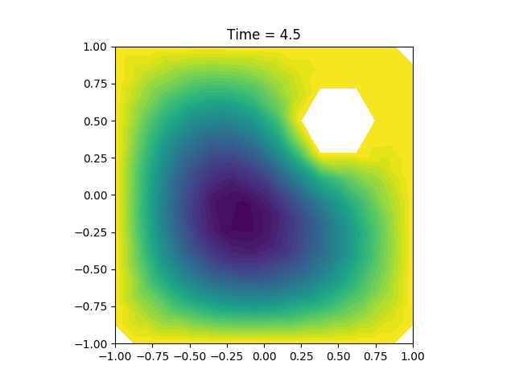 |
| num=20 | 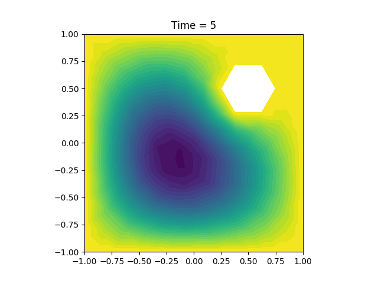 |
