# Fenics]

## dpg_laplace_adapt

- "Error:   Unable to successfully call PETSc function 'KSPSolve'."
  - PETSc error code is: 76 (Error in external library).
  - <https://fenicsproject.org/qa/4177/reason-petsc-error-code-is-76/>
- "Calling FFC just-in-time (JIT) compiler, this may take some time."
  - <https://fenicsproject.discourse.group/t/calling-ffc-just-in-time-jit-compiler-this-may-take-some-time/2275>

| mesh                                  | sol                                |
| ------------------------------------- | ---------------------------------- |
|    |   |
| 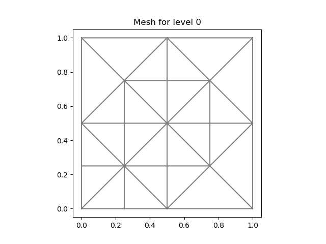 |  |
|  |  |
| 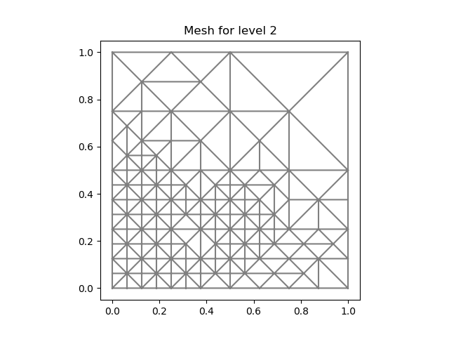 |  |
| 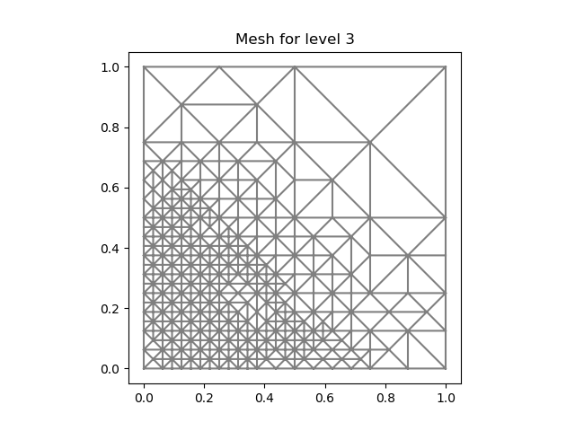 | 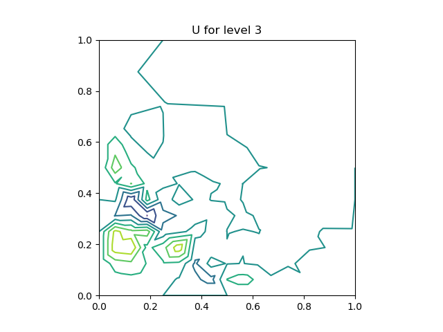 |
| 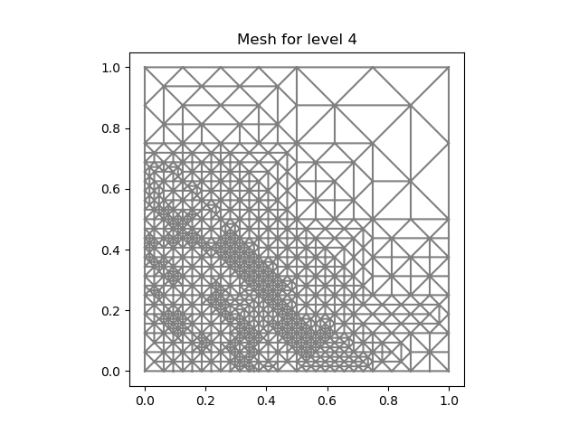 | 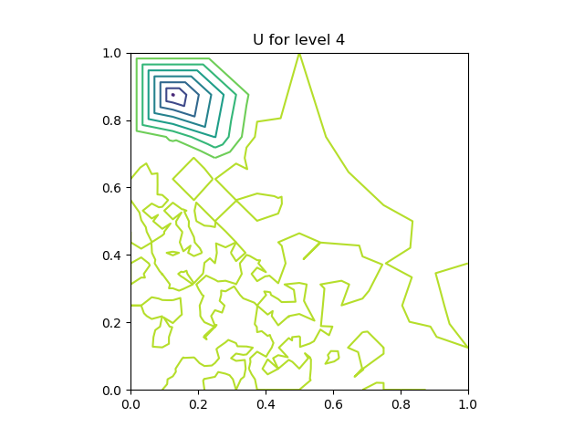 |
| 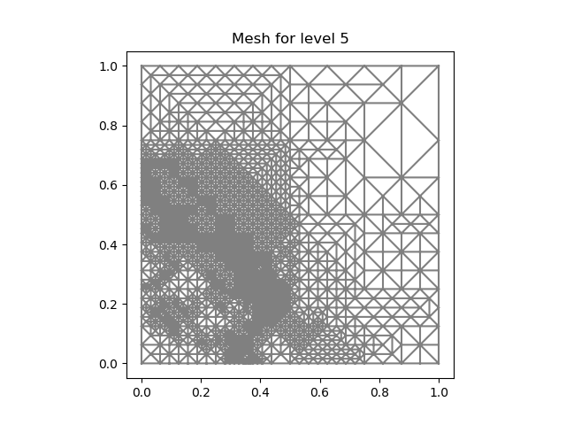 | 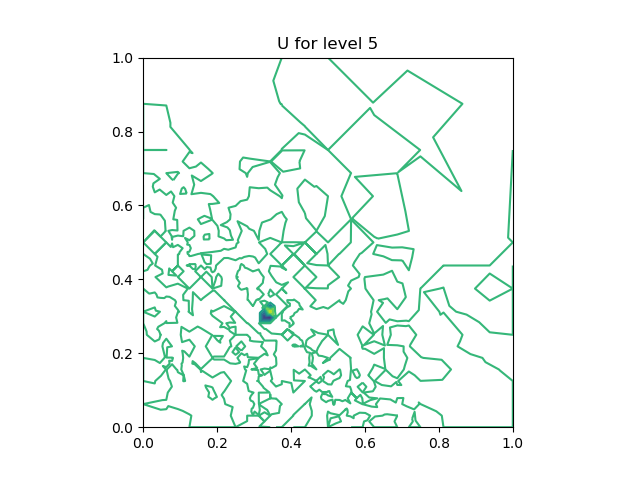 |
|  |  |
| 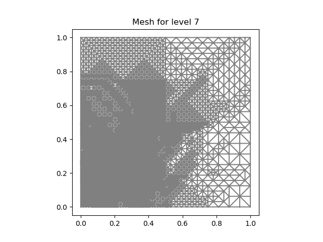 |  |
| 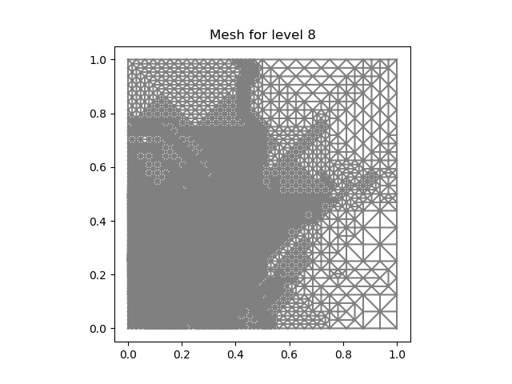 | 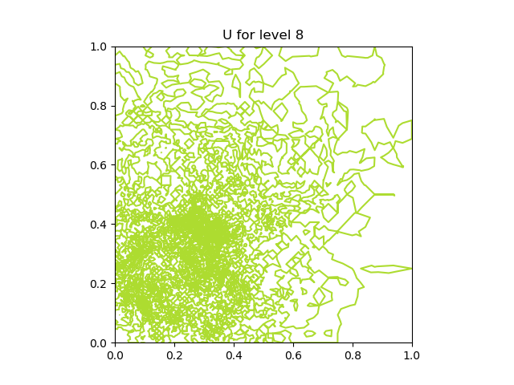 |

## heat_explicit

|      num | sol                                                     |          |                                                         |
| -------: | ------------------------------------------------------- | -------: | ------------------------------------------------------- |
|    num=0 | 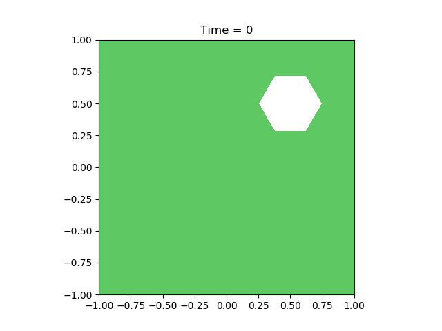    |  num=500 |   |
| num= 100 |   |  num=700 |   |
| num= 200 |   |  num=800 |   |
| num= 300 |   |  num=900 |   |
| num= 400 |  | num=1000 |  |

## heat_implicit

|    num | sol                                                   |    num | sol                                                   |
| -----: | ----------------------------------------------------- | -----: | ----------------------------------------------------- |
| num= 0 |   | num=12 |  |
| num= 2 |   | num=14 |  |
| num= 4 |   | num=16 |  |
| num= 6 |   | num=18 |  |
| num= 8 |   | num=20 |  |
| num=10 |  |

## Step11 Error Decay for a Sequence of Adaptive Meshes

uses the Discontinuous Petrov Galerkin (DPG) method
to solve a Poisson problem, and repeatedly refines the mesh, guided by DPG error indicators

| case0                                         | case1                                         |
| --------------------------------------------- | --------------------------------------------- |
| 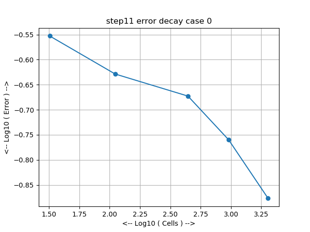 | 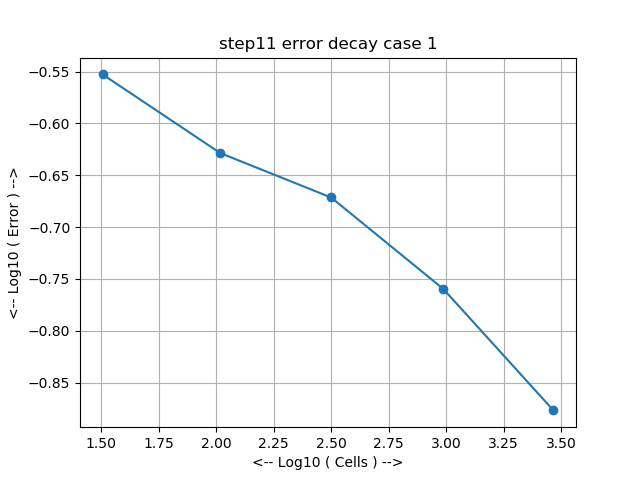 |
| 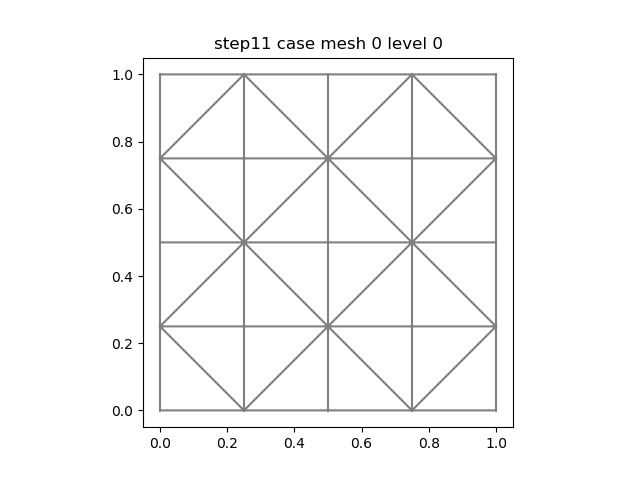 | 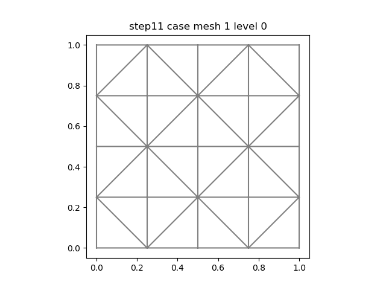 |
| 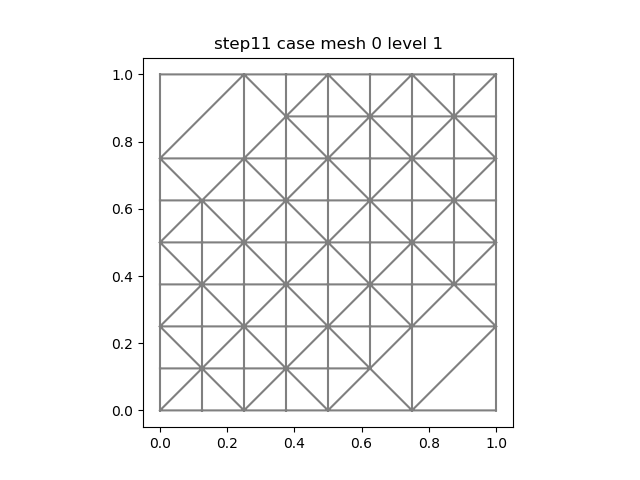 | 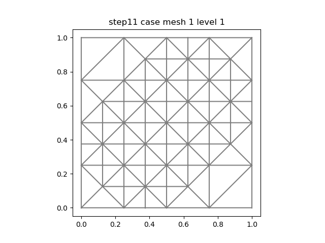 |
| 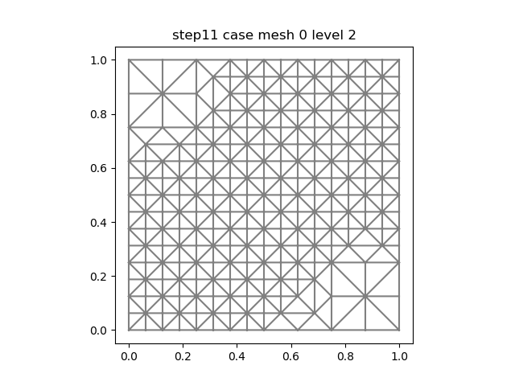 |  |
| 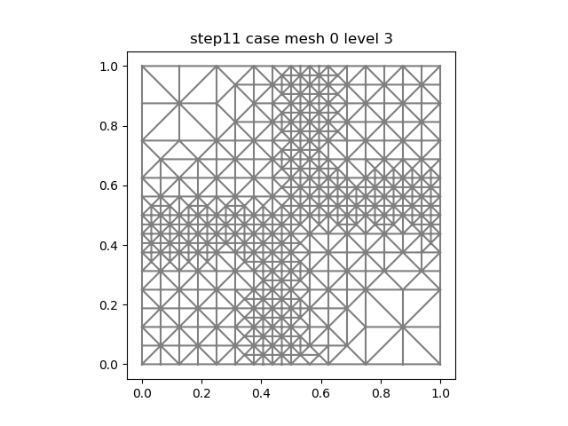 | 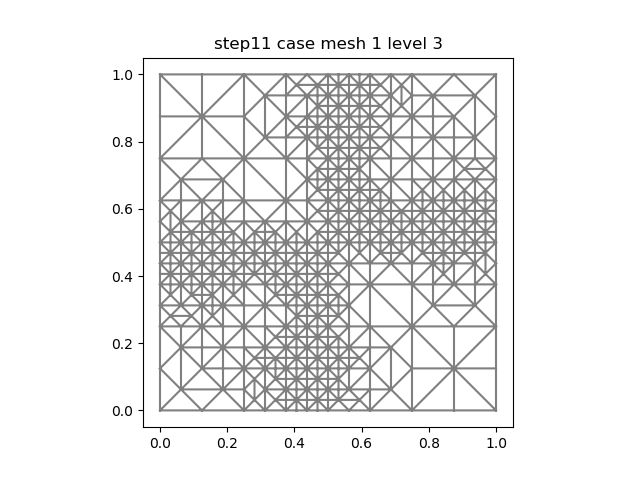 |
| 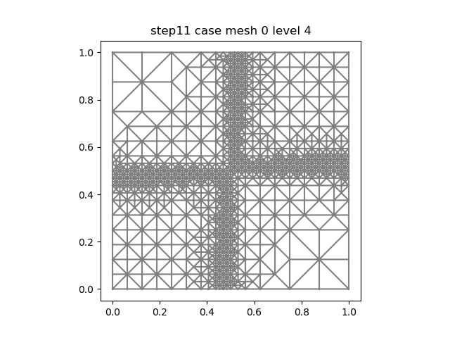 |  |
